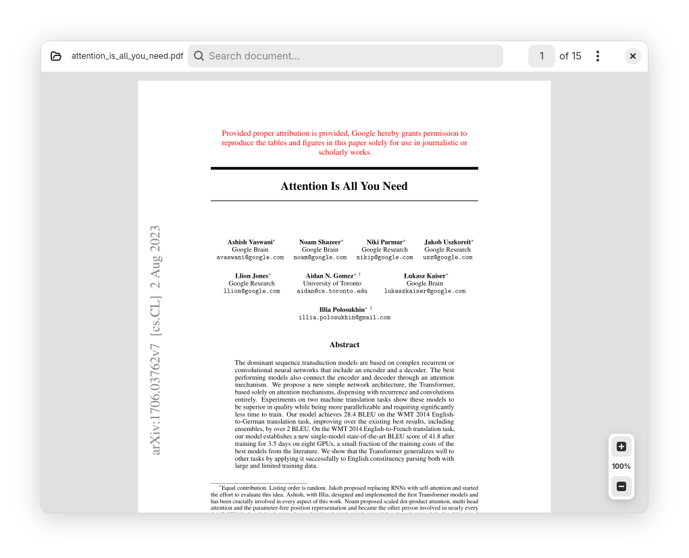
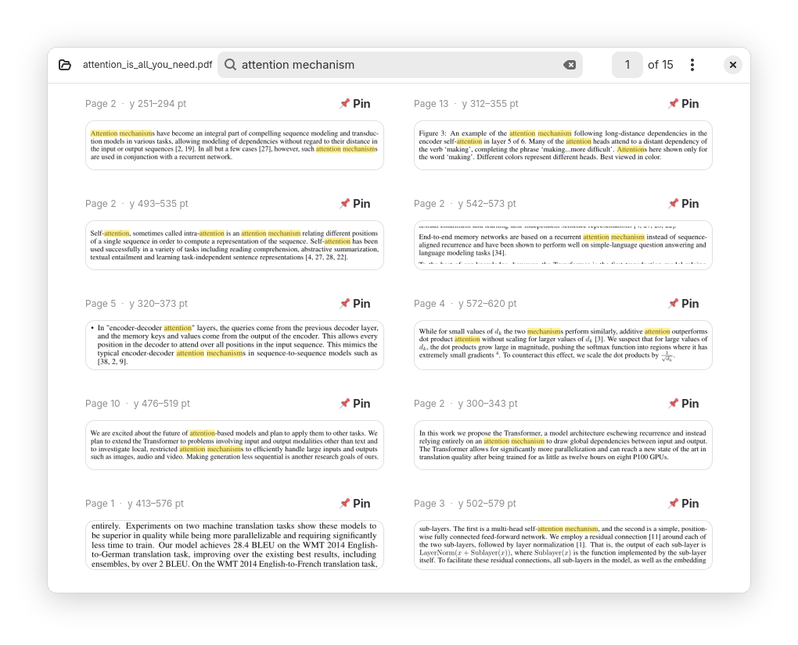
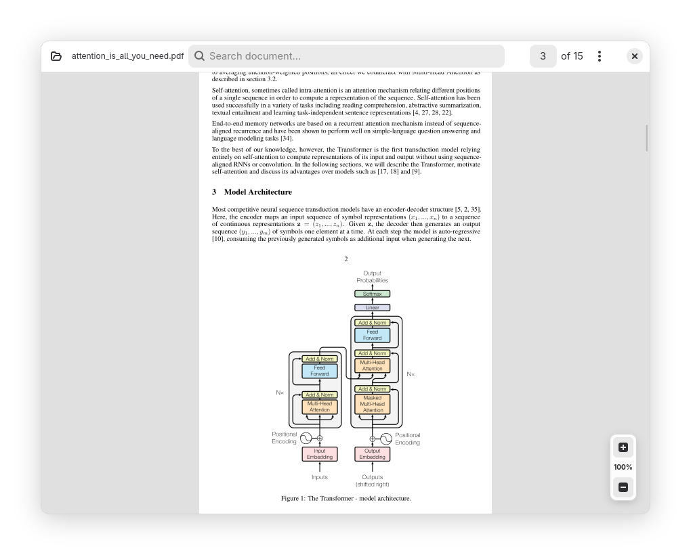
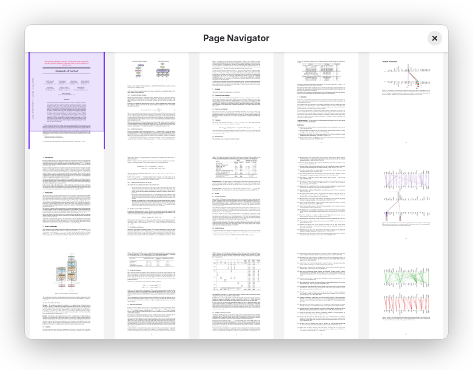

# PDF Atlas

> [!NOTE]
> This project was built with a _reasonable amount of AI assistance_. As a result, parts of the codebase might be a bit sloppy, but this doesn't mean that I don't care and I will try my best to manage and maintain it. Issues and _smallish_ PRs are welcome.

A high-performance, modern PDF reader built with Python, GTK4, Libadwaita, Cairo, PyMuPDF, and OpenGL hardware acceleration. Key features include continuous page scrolling, dynamic auto-crop margins, a multi-column grid minimap navigator, and an integrated SQLite FTS5 search engine that presents results as cropped "portals" of matching text sections.

<p align="center">
  
</p>

---

## Key Features



### FTS5 Search Portals

Entering text in the headerbar instantly switches the application from Document View to Search View:

- Excerpt results are presented as tightly cropped image strips ("portals") displaying exact visual context.
- Cairo overlays highlight search term matches across both search portals and the continuous canvas.
- Excerpt pinning allows users to bookmark key context snippets.
- Clicking any search portal card smoothly transitions back to Reader Mode and scrolls directly to the match location.

<br clear="all" />



### Continuous Reader & Gap-less Mode

Features smooth vertical page layout using PyMuPDF with dual Cairo vector and hardware-accelerated OpenGL (`PyOpenGL`) rendering backends:

- Asynchronous background thread workers handle rendering to keep the interface responsive at 60 FPS.
- Seamless gap-less mode connects pages continuously without artificial visual gaps.
- Full viewport mouse-centered smooth zooming.

<br clear="all" />



### Grid Minimap Navigator

Pressing `M` opens a multi-column grid thumbnail navigator overlay:

- Displays all document page thumbnails in a wrapping multi-column grid.
- Tracks the active viewport position in real time with translucent overlays.
- Visualizes auto-crop boundaries across pages and allows instant grid navigation.

<br clear="all" />

### Smart Auto-Crop Margins & Fast Index Caching

- **Auto-Crop Margins (`C`):** Automatically detects page whitespace boundaries in background threads, eliminating margins to maximize font sizes on smaller screens.
- **Cryptographic Cache:** Search indexes are cached locally in `~/.cache/pdfatlas/<sha256>.db` keyed by the document's SHA-256 digest for instant subsequent document loads.

---

## Architecture

```
pdfatlas/
├── pdf_viewer/              # Main application package
│   ├── __init__.py          # Package initialization
│   ├── main.py              # Application entry point (Adw.Application & CLI parser)
│   ├── core/                # Core non-UI logic and indexing engines
│   │   ├── __init__.py      # Package init
│   │   ├── cache.py         # LRU RenderCache & MiniMapCache
│   │   ├── crop.py          # Background margin cropping analyzer logic
│   │   ├── document.py      # PyMuPDF fitz.Document thread-safe wrapper
│   │   ├── index.py         # SQLite FTS5 text indexing and search logic
│   │   ├── renderer.py      # Multi-threaded background render worker pool
│   │   └── settings.py      # App settings model & state management
│   └── ui/                  # GTK4 / Libadwaita UI components
│       ├── __init__.py      # Package init
│       ├── canvas.py        # Cairo-based continuous scroll PDF canvas
│       ├── gl_canvas.py     # OpenGL hardware-accelerated continuous scroll canvas
│       ├── minimap.py       # Minimap thumbnail drawing & modal navigator window
│       ├── portal.py        # FTS search result card list item (ResultRow)
│       ├── settings.py      # Settings popover & configuration dialog
│       └── window.py        # MainWindow (Adw.HeaderBar, Gtk.Stack navigation)
├── assets/
│   ├── sample-files/        # Sample PDF documents
│   └── screenshots/         # Documentation screenshots
├── prototypes/              # Prototype scripts & launcher shortcuts
├── scripts/                 # Maintenance and benchmark scripts
├── pyproject.toml           # Packaging and dependency declarations
├── README.md                # Project documentation
└── uv.lock                  # Lockfile
```

---

## Requirements

- Python 3.11+
- GTK 4 & Libadwaita (`libgirepository1.0-dev`, `gir1.2-adw-1`)
- Cairo development libraries (`libcairo2-dev`)
- PIL/Pillow, PyMuPDF, and PyOpenGL

---

## Getting Started

### Installation as a System-Wide Tool

Install `pdfatlas` directly from GitHub using `uv`:

```bash
uv tool install git+https://github.com/aziis98/pdfatlas.git
```

Or install from a local clone of the repository:

```bash
uv tool install .
```

Once installed, launch the application from anywhere using:

```bash
pdfatlas [path/to/document.pdf]
```

---

### Local Development

To install dependencies and run locally:

```bash
# Install dependencies
uv sync

# Launch with hardware-accelerated OpenGL renderer (default)
uv run main.py [path/to/document.pdf]

# Launch with standard Cairo backend renderer
uv run python main.py [path/to/document.pdf] --backend cairo

# Programmatic screenshot / state restore
uv run python main.py [path/to/document.pdf] --state '{"query": "attention"}' --screenshot screenshots.local/out.png
```

---

## Keyboard Shortcuts

| Shortcut                | Action                                     |
| ----------------------- | ------------------------------------------ |
| `Ctrl+O`                | Open PDF Document                          |
| `Ctrl+L`                | Focus Search Bar                           |
| `+` / `-` / `=`         | Zoom In / Out                              |
| `Ctrl+scroll`           | Zoom centered on cursor                    |
| `Ctrl+0`                | Reset Zoom to 100%                         |
| `W`                     | Fit Page Width                             |
| `F`                     | Fit Entire Page in Viewport                |
| `M`                     | Toggle Pages Minimap Navigator             |
| `C`                     | Toggle Auto-crop margins                   |
| `Page Up` / `Page Down` | Scroll by viewport height                  |
| `Left` / `Right` or `h` / `l` | Scroll Back / Forward by viewport height   |
| `Up` / `Down` or `k` / `j` | Fine step scroll Up / Down                 |
| `Escape`                | Clear/exit search or close Minimap modal   |
| `Ctrl+Q` or `q`         | Quit                                       |

---

## Contributing

Issues and _smallish_ PRs are welcome. For larger features, prefer creating an issue tagged with **enhancement** to suggest new feature ideas rather than opening a large PR directly.

## License

MIT License.
