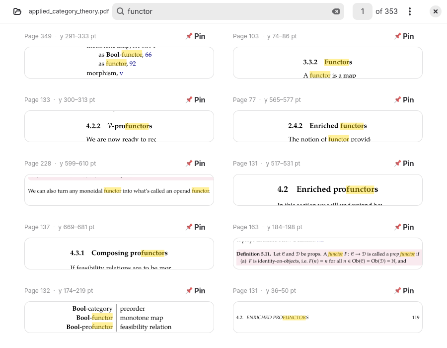
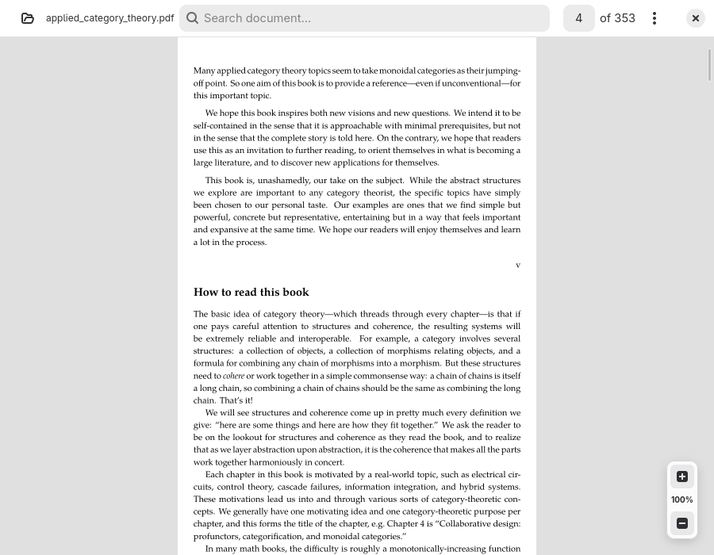
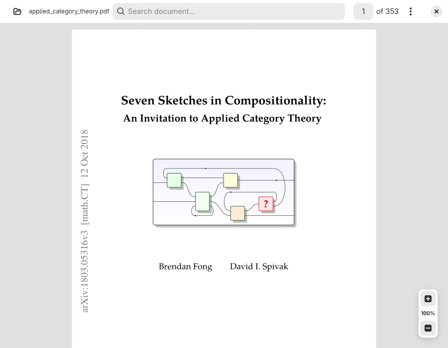

# PDF Atlas

A high-performance, modern PDF reader built with Python, GTK4, Libadwaita, Cairo, PyMuPDF, and OpenGL hardware acceleration. Key features include continuous page scrolling, dynamic auto-crop margins, a multi-column grid minimap navigator, and an integrated SQLite FTS5 search engine that presents results as cropped "portals" of matching text sections.

Search indexes are cached locally in the user's XDG cache directory (`~/.cache/pdf-reader-portals/<sha256>.db`) and mapped by the document's SHA-256 hash for instant subsequent lookups.

---

<p align="center">
  
</p>

<p align="center">
  
  
</p>
<br clear="all" />

---

## Key Features

- **Continuous Scroll & Dual Rendering Engines:** 
  Smooth vertical page rendering using PyMuPDF. Features both Cairo vector rendering and hardware-accelerated OpenGL (`PyOpenGL`) canvas backends. All page renders execute in a background thread pool to keep the UI at 60 FPS.

- **Smart Auto-Crop Margins:** 
  Analyzes page whitespace bounds in the background and automatically crops unnecessary page margins, maximizing text zoom and readability on display screens.

- **Grid Minimap Navigator:** 
  A multi-column grid thumbnail window tracking the active viewport, displaying crop region overlays and enabling rapid grid navigation across large documents.

- **FTS5 Search Portals:** 
  Entering search text in the headerbar switches the application from Document View to Search View:
  - Match excerpts are displayed as cropped image strips ("portals") showing exact visual context.
  - Cairo overlays highlight query matches inside both search portals and the main canvas.
  - Excerpt pinning lets users save key context snippets.
  - Clicking any search result card instantly switches back to Reader Mode and smoothly scrolls to the match location.

- **Cryptographic Search Caching:** 
  FTS5 text indexes are saved to SQLite DBs in `~/.cache/pdf-reader-portals/<sha256>.db` using SHA-256 file digests, avoiding repetitive indexing runs.

---

## Showcase

<p align="center">
  
</p>

<p align="center">
  
  
</p>
<br clear="all" />

---

## Architecture

```
pdfatlas/
├── pdf_viewer/              # Main application package
│   ├── __init__.py          # Package initialization
│   ├── main.py              # Application entry point (Adw.Application & CLI parser)
│   ├── core/                # Core non-UI logic and indexing engines
│   │   ├── __init__.py      # Package init
│   │   ├── cache.py         # LRU RenderCache & MiniMapCache
│   │   ├── crop.py          # Background margin cropping analyzer logic
│   │   ├── document.py      # PyMuPDF fitz.Document thread-safe wrapper
│   │   ├── index.py         # SQLite FTS5 text indexing and search logic
│   │   ├── renderer.py      # Multi-threaded background render worker pool
│   │   └── settings.py      # App settings model & state management
│   └── ui/                  # GTK4 / Libadwaita UI components
│       ├── __init__.py      # Package init
│       ├── canvas.py        # Cairo-based continuous scroll PDF canvas
│       ├── gl_canvas.py     # OpenGL hardware-accelerated continuous scroll canvas
│       ├── minimap.py       # Minimap thumbnail drawing & modal navigator window
│       ├── portal.py        # FTS search result card list item (ResultRow)
│       ├── settings.py      # Settings popover & configuration dialog
│       └── window.py        # MainWindow (Adw.HeaderBar, Gtk.Stack navigation)
├── assets/
│   ├── sample-files/        # Sample PDF documents
│   └── screenshots/         # Documentation screenshots
├── prototypes/              # Prototype scripts & launcher shortcuts
├── scripts/                 # Maintenance and benchmark scripts
├── pyproject.toml           # Packaging and dependency declarations
├── README.md                # Project documentation
└── uv.lock                  # Lockfile
```

---

## Requirements

- Python 3.11+
- GTK 4 & Libadwaita (`libgirepository1.0-dev`, `gir1.2-adw-1`)
- Cairo development libraries (`libcairo2-dev`)
- PIL/Pillow, PyMuPDF, and PyOpenGL

---

## Getting Started

### Installation as a System-Wide Tool

Install `pdfatlas` directly from GitHub using `uv`:

```bash
uv tool install git+https://github.com/aziis98/pdfatlas.git
```

Or install from a local clone of the repository:

```bash
uv tool install .
```

Once installed, launch the application from anywhere using:

```bash
pdfatlas [path/to/document.pdf]
```

---

### Local Development

To install dependencies and run locally:

```bash
# Install dependencies
uv sync

# Launch with hardware-accelerated OpenGL renderer (default)
uv run pdfatlas [path/to/document.pdf]

# Launch with standard Cairo backend renderer
uv run python main.py [path/to/document.pdf] --backend cairo

# Programmatic screenshot / state restore
uv run python main.py [path/to/document.pdf] --state '{"query": "attention"}' --screenshot screenshots.local/out.png
```

---

## Keyboard Shortcuts

| Shortcut                | Action                                     |
| ----------------------- | ------------------------------------------ |
| `Ctrl+O`                | Open PDF Document                          |
| `Ctrl+L`                | Focus Search Bar                           |
| `+` / `-` / `=`         | Zoom In / Out                              |
| `Ctrl+scroll`           | Zoom centered on cursor                    |
| `Ctrl+0`                | Reset Zoom to 100%                         |
| `M`                     | Toggle Pages Minimap Navigator             |
| `C`                     | Toggle Auto-crop margins                   |
| `Page Up` / `Page Down` | Scroll by one page/viewport height         |
| `Up` / `Down`           | Scroll step up / down                      |
| `Escape`                | Clear/close search or close active dialogs |
| `Ctrl+Q` or `q`         | Quit                                       |

---

## License

MIT License.
