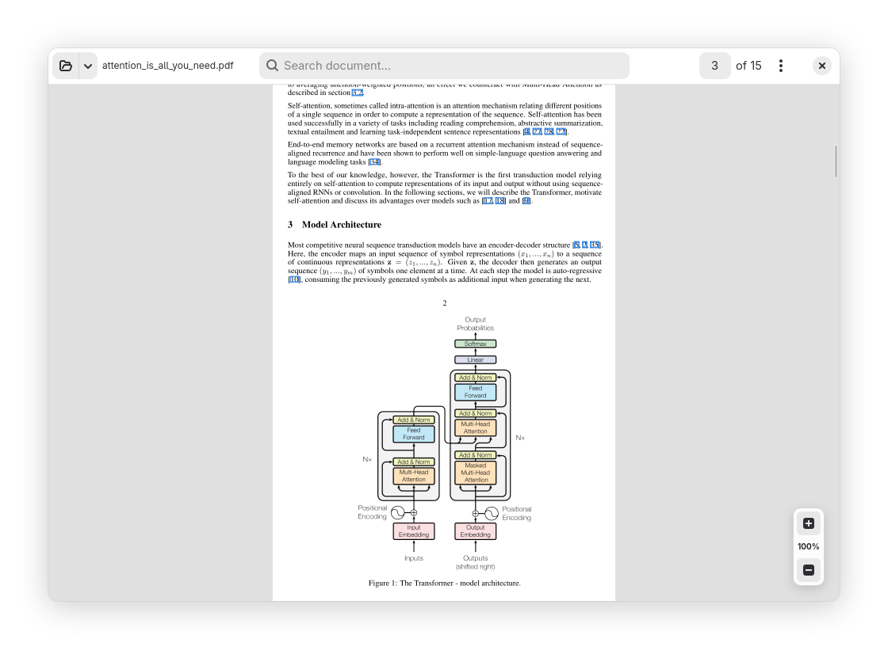
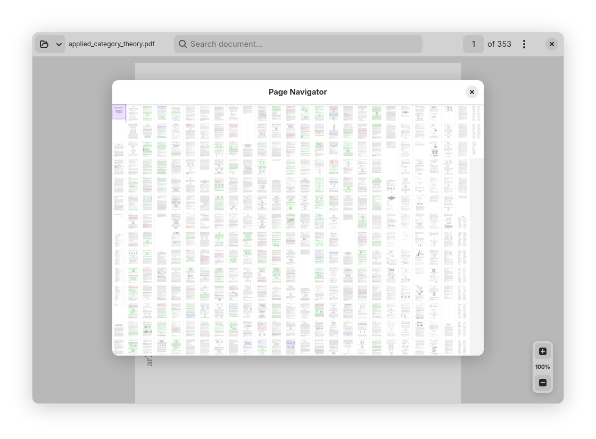

# PDF Atlas

> [!NOTE]
> This project was built with a _reasonable amount of AI assistance_. As a result, parts of the codebase might be a bit sloppy, but this doesn't mean that I don't care and I will try my best to manage and maintain it. Issues and _smallish_ PRs are welcome.


A PDF reader built with Python, GTK4, Libadwaita, PyMuPDF, and OpenGL. Features continuous page scrolling, page margin auto-cropping, a page thumbnail grid, and SQLite FTS5 text search with inline snippet previews.

<p align="center">
  
</p>

## Key Features


### Full-Text Search ("Portals")

Entering text in the headerbar switches the application from Document View to Search View:

- Excerpt results are presented as cropped image strips ("portals") displaying exact visual context.
- Search term matches are highlighted across search portals and the continuous canvas.
- Excerpt pinning allows bookmarking key context snippets.
- Clicking a search portal card returns to Reader Mode and scrolls directly to the match.

<br clear="all" />



### Continuous Reading & Gap-less View

Vertical page layout using PyMuPDF with Cairo vector and hardware-accelerated OpenGL (`PyOpenGL`) rendering backends:

- Uses background worker threads for page rendering to keep scrolling responsive.
- Gap-less mode connects pages vertically without page margins.
- Mouse-centered canvas zooming.

<br clear="all" />



### Page Thumbnail Grid / Minimap

Pressing `M` opens a page thumbnail grid overlay:

- Displays all document page thumbnails in a wrapping multi-column grid.
- Highlights the current viewport position and page crop boundaries.
- Allows quick navigation across document pages.

<br clear="all" />

### Auto-Crop Margins & Index Caching

- **Auto-Crop Margins (`C`):** Trims page whitespace margins in the background to maximize readable text area on smaller screens.
- **Search Index Cache:** Text search indexes are cached in `~/.cache/pdfatlas/` keyed by file SHA-256 for faster opening on subsequent runs.

<br clear="all" />


### Text Selection & Copy

Highlight text in any document to reveal the bottom context toolbar:

- **PDF Plain Text Copy (`Ctrl+Shift+C` / "Copy"):** Copies selected plain text from the PDF.
- **LaTeX Source Copy (`Ctrl+C` / "Copy Source"):** For arXiv papers, PDF Atlas attempts to map character selections back to original LaTeX source code.
- **Shortcuts Info:** Click the info icon for quick access to selection shortcuts.

<br clear="all" />


## Architecture

```
pdfatlas/
├── pdf_viewer/              # Main application package
│   ├── __init__.py          # Package initialization
│   ├── main.py              # Application entry point (Adw.Application & CLI parser)
│   ├── core/                # Core non-UI logic and indexing engines
│   │   ├── __init__.py      # Package init
│   │   ├── cache.py         # LRU RenderCache & MiniMapCache
│   │   ├── crop.py          # Background margin cropping analyzer logic
│   │   ├── document.py      # PyMuPDF fitz.Document thread-safe wrapper
│   │   ├── index.py         # SQLite FTS5 text indexing and search logic
│   │   ├── renderer.py      # Multi-threaded background render worker pool
│   │   └── settings.py      # App settings model & state management
│   └── ui/                  # GTK4 / Libadwaita UI components
│       ├── __init__.py      # Package init
│       ├── canvas.py        # Cairo-based continuous scroll PDF canvas
│       ├── gl_canvas.py     # OpenGL hardware-accelerated continuous scroll canvas
│       ├── minimap.py       # Minimap thumbnail drawing & modal navigator window
│       ├── portal.py        # FTS search result card list item (ResultRow)
│       ├── settings.py      # Settings popover & configuration dialog
│       └── window.py        # MainWindow (Adw.HeaderBar, Gtk.Stack navigation)
├── assets/
│   ├── sample-files/        # Sample PDF documents
│   └── screenshots/         # Documentation screenshots
├── prototypes/              # Prototype scripts & launcher shortcuts
├── scripts/                 # Maintenance and benchmark scripts
├── pyproject.toml           # Packaging and dependency declarations
├── README.md                # Project documentation
└── uv.lock                  # Lockfile
```

## Requirements

- Python 3.11+
- GTK 4 & Libadwaita (`libgirepository1.0-dev`, `gir1.2-adw-1`)
- Cairo development libraries (`libcairo2-dev`)
- PIL/Pillow, PyMuPDF, and PyOpenGL

## Getting Started

### Installation as a System-Wide Tool

Install `pdfatlas` directly from GitHub using `uv`:

```bash
uv tool install git+https://github.com/aziis98/pdfatlas.git
```

Or install from a local clone of the repository:

```bash
uv tool install .
```

Once installed, launch the application from anywhere using:

```bash
# Open a local PDF file
pdfatlas path/to/document.pdf

# Open an arXiv paper directly by ID or URL
pdfatlas 1706.03762
pdfatlas https://arxiv.org/abs/2305.12345
```

### Local Development

To install dependencies and run locally:

```bash
# Install dependencies
uv sync

# Launch with hardware-accelerated OpenGL renderer (default)
uv run main.py 1706.03762

# Launch with arXiv sourcemap debug overlay enabled
uv run main.py 1706.03762 --debug
```


## Keyboard Shortcuts

| Shortcut                | Action                                     |
| ----------------------- | ------------------------------------------ |
| `Ctrl+O`                | Open PDF Document                          |
| `Ctrl+L`                | Focus Search Bar                           |
| `+` / `-` / `=`         | Zoom In / Out                              |
| `Ctrl+scroll`           | Zoom centered on cursor                    |
| `Ctrl+0`                | Reset Zoom to 100%                         |
| `W`                     | Fit Page Width                             |
| `F`                     | Fit Entire Page in Viewport                |
| `M`                     | Toggle Pages Minimap Navigator             |
| `C`                     | Toggle Auto-crop margins                   |
| `Page Up` / `Page Down` | Scroll by viewport height                  |
| `Left` / `Right` or `h` / `l` | Scroll Back / Forward by viewport height   |
| `Up` / `Down` or `k` / `j` | Fine step scroll Up / Down                 |
| `Ctrl+C`                | Copy Source TeX (if available, else PDF text) |
| `Ctrl+Shift+C`          | Copy raw PDF text                          |
| `Escape`                | Clear selection/search or close Minimap modal |
| `Ctrl+Q` or `q`         | Quit                                       |

## Contributing

Issues and _smallish_ PRs are welcome. For larger features, prefer creating an issue tagged with **enhancement** to suggest new feature ideas rather than opening a large PR directly.

## License

MIT License.
